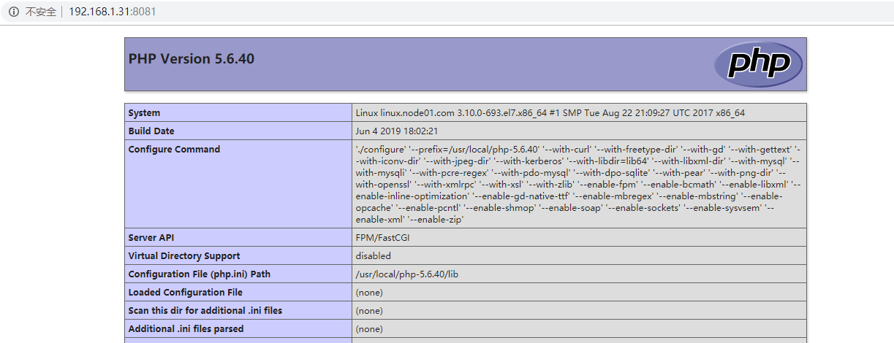

## 项目规划
> 通过`ansible roles`配置`lnmp`环境，`nginx`通过源码编译安装，`php`通过源码编译安装，`mysql`通过`yum`安装（`mysql`源码编译超级慢）支持系统（`centos6.x`和`centos7.x`系列）

>**说明:**将nginx和php源码包放到对应的角色文件下的files目录下，通过vars/main.yml控制安装的版本和路径。如下：

```
[root@ansible roles]# cat nginx/vars/main.yml 
DOWNLOAD_DIR: "/usr/local/src/"  #软件包拷贝到目标主机的存放路径
INSTALL_DIR: "/usr/local/"       #安装路径
NGINX_VERSION: "1.12.2"          #软件包版本
USER: "nginx"                    #运行的用户
GROUP: "nginx"                   #运行的组
```

[环境配置参考](https://buji595.github.io/2019/05/26/Ansible%E5%BF%AB%E9%80%9F%E5%85%A5%E9%97%A8/)

## 角色编写
> 这里角色都统一放在了`/etc/ansible/roles`下

安装编译时所需要用到的依赖包
```
[root@ansible roles]# cat init_pkg.yml 
#安装源码编译php、nginx时所需要用到的依赖包
---
- hosts: all 
  remote_user: root

  tasks:
    - name: Install Package
      yum: name={{ item }} state=installed
      with_items:
        - gcc-c++
        - glibc
        - glibc-devel
        - glib2
        - glib2-devel
        - pcre
        - pcre-devel
        - zlib
        - zlib-devel
        - openssl
        - openssl-devel
        - libpng
        - libpng-devel
        - freetype
        - freetype-devel
        - libxml2
        - libxml2-devel
        - bzip2
        - bzip2-devel
        - ncurses
        - curl
        - gdbm-devel
        - libXpm-devel
        - libX11-devel
        - gd-devel
        - gmp-devel
        - readline-devel
        - libxslt-devel
        - expat-devel
        - xmlrpc-c
        - libcurl-devel
```
```
[root@ansible ~]# cd /etc/ansible/roles/
```
### nginx roles
1）创建相应文件夹
```
[root@ansible roles]# mkdir -p nginx/{files,handlers,tasks,templates,vars}
```
2）最终编写效果
```
[root@ansible roles]# tree nginx
nginx
├── files
│   ├── nginx-1.12.2.tar.gz
│   └── nginx-1.16.0.tar.gz
├── handlers
│   └── main.yml
├── tasks
│   ├── config.yml
│   ├── copypkg.yml
│   ├── group.yml
│   ├── install.yml
│   ├── main.yml
│   ├── service.yml
│   └── user.yml
├── templates
│   ├── nginx.conf.j2
│   ├── nginx_init.j2
│   └── nginx.service.j2
└── vars
    └── main.yml

5 directories, 14 files
```

### php roles
1）创建相应文件夹
```
[root@ansible roles]# mkdir -p php/{files,handlers,tasks,templates,vars}
```
2）最终编写效果
```
[root@ansible roles]# tree php
php
├── files
│   └── php-5.6.40.tar.gz
├── handlers
│   └── main.yml
├── tasks
│   ├── config.yml
│   ├── copypkg.yml
│   ├── group.yml
│   ├── install.yml
│   ├── main.yml
│   ├── service.yml
│   └── user.yml
├── templates
│   ├── php-fpm.conf.j2
│   ├── php-fpm.init.j2
│   ├── php-fpm.service.j2
│   └── php.ini.j2
└── vars
    └── main.yml

5 directories, 14 files
```


### mysql roles
1）创建相应文件夹
```
[root@ansible roles]# mkdir -p mysql/{files,handlers,tasks,templates,vars}
```
2）最终编写效果
```
[root@ansible roles]# tree mysql
mysql
├── files
├── handlers
│   └── main.yml
├── tasks
│   ├── config.yml
│   ├── install.yml
│   ├── main.yml
│   └── service.yml
├── templates
│   ├── my.cnf6.j2
│   └── my.cnf7.j2
└── vars

5 directories, 7 files
```
### 角色执行playbook文件编写
```
[root@ansible roles]# cat nginx_roles.yml 
#源码编译安装nginx
---
- hosts: all
  remote_user: root
  roles:
    - role: nginx


[root@ansible roles]# cat php_roles.yml 
#源码编译安装nginx
---
- hosts: all
  remote_user: root
  roles:
    - role: php


[root@ansible roles]# cat mysql_roles.yml 
#yum安装MySQL
---
- hosts: all
  remote_user: root
  roles:
    - role: mysql 


[root@ansible roles]# cat lnmp.yml 
#配置lnmp,创建虚拟主机
---
- hosts: all
  remote_user: root
  roles:
    - role: nginx
    - role: php 
    - role: mysql
  
  vars:
    PORT: 8081
    WEBDIR: "/opt/www"
    CONFIGDIR: "/usr/local/nginx/conf/conf.d"

  tasks:
    - name: create vhost dir
      file: name={{ WEBDIR }} state=directory owner=www group=www mode=755

    - name: create vhost conf
      template: src=vhost.conf.j2 dest={{ CONFIGDIR }}/vhost.conf
      notify: Restart Nginx

    - name: create index.php
      shell: "echo '<?php phpinfo(); ?>' > {{ WEBDIR }}/index.php"
    
  handlers:
    - name: Restart Nginx
      service: name=nginx state=restarted


# hostslist文件准备，这样方便执行，可以在执行playbook时指定某台机器上运行
[root@ansible roles]# cat hostlist 
192.168.1.31
192.168.1.32
192.168.1.33
192.168.1.36


#所有文件查看
[root@ansible roles]# ll 
总用量 28
-rw-r--r--. 1 root root  53 6月   4 22:37 hostlist
-rw-r--r--. 1 root root 824 6月   5 10:53 init_pkg.yml
-rw-r--r--. 1 root root 646 6月   5 12:05 lnmp.yml
drwxr-xr-x. 7 root root  77 6月   5 10:44 mysql
-rw-r--r--. 1 root root  81 6月   5 10:06 mysql_roles.yml
drwxr-xr-x. 7 root root  77 6月   4 15:37 nginx
-rw-r--r--. 1 root root  89 6月   4 17:10 nginx_roles.yml
drwxr-xr-x. 7 root root  77 6月   4 17:18 php
-rw-r--r--. 1 root root  87 6月   4 17:37 php_roles.yml
-rw-r--r--. 1 root root 811 6月   5 11:53 vhost.conf.j2
```
## 所有文件查看

```
[root@ansible roles]# tree 
.
├── hostlist
├── init_pkg.yml
├── lnmp.yml
├── mysql
│   ├── files
│   ├── handlers
│   │   └── main.yml
│   ├── tasks
│   │   ├── config.yml
│   │   ├── install.yml
│   │   ├── main.yml
│   │   └── service.yml
│   ├── templates
│   │   ├── my.cnf6.j2
│   │   └── my.cnf7.j2
│   └── vars
├── mysql_roles.yml
├── nginx
│   ├── files
│   │   ├── nginx-1.12.2.tar.gz
│   │   └── nginx-1.16.0.tar.gz
│   ├── handlers
│   │   └── main.yml
│   ├── tasks
│   │   ├── config.yml
│   │   ├── copypkg.yml
│   │   ├── group.yml
│   │   ├── install.yml
│   │   ├── main.yml
│   │   ├── service.yml
│   │   └── user.yml
│   ├── templates
│   │   ├── nginx.conf.j2
│   │   ├── nginx_init.j2
│   │   └── nginx.service.j2
│   └── vars
│       └── main.yml
├── nginx_roles.yml
├── php
│   ├── files
│   │   └── php-5.6.40.tar.gz
│   ├── handlers
│   │   └── main.yml
│   ├── tasks
│   │   ├── config.yml
│   │   ├── copypkg.yml
│   │   ├── group.yml
│   │   ├── install.yml
│   │   ├── main.yml
│   │   ├── service.yml
│   │   └── user.yml
│   ├── templates
│   │   ├── php-fpm.conf.j2
│   │   ├── php-fpm.init.j2
│   │   ├── php-fpm.service.j2
│   │   └── php.ini.j2
│   └── vars
│       └── main.yml
├── php_roles.yml
└── vhost.conf.j2

18 directories, 42 files
```
## 执行说明
1）单独某一台机器安装nginx
```
[root@ansible roles]# ansible-playbook -i hostlist nginx_roles.yml --limit 192.168.1.31
```
2）单独某一台机器安装php
```
[root@ansible roles]# ansible-playbook -i hostlist php_roles.yml --limit 192.168.1.31
```
3）单独某一台机器安装mysql
```
[root@ansible roles]# ansible-playbook -i hostlist mysql_roles.yml --limit 192.168.1.31
```
4）单独某一台机器部署lnmp
```
[root@ansible roles]# ansible-playbook -i hostlist lnmp.yml --limit 192.168.1.31
```
5）所有机器部署php
```
[root@ansible roles]# ansible-playbook php_roles.yml
```
6）所有机器部署nginx
```
[root@ansible roles]# ansible-playbook nginx_roles.yml
```
7）所有机器部署mysql
```
[root@ansible roles]# ansible-playbook mysql_roles.yml
```
8）所有机器部署lnmp
```
[root@ansible roles]# ansible-playbook lnmp.yml
```




