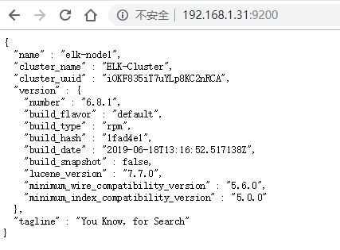
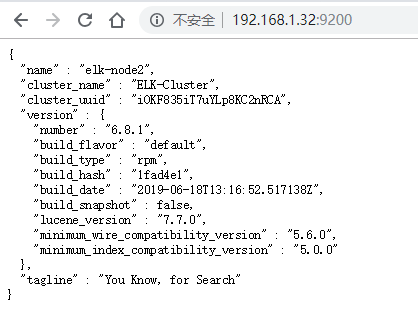
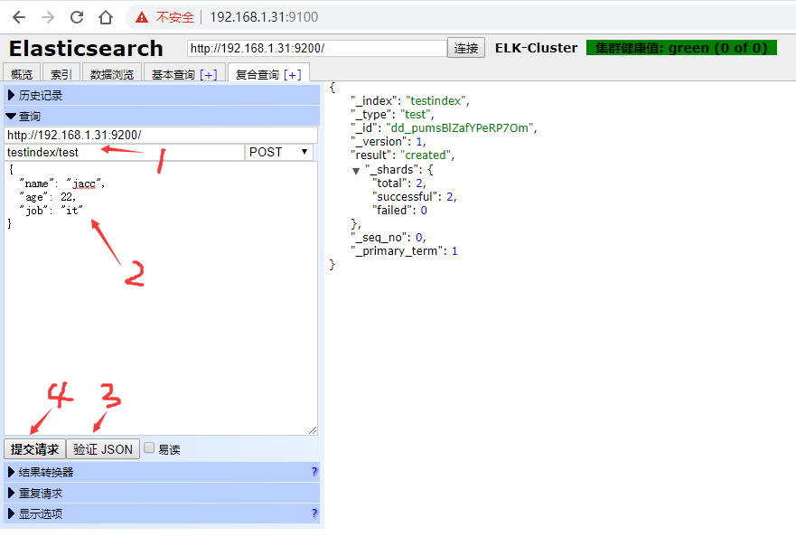
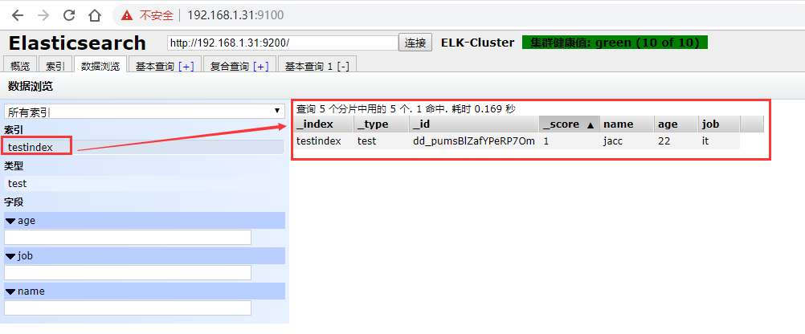
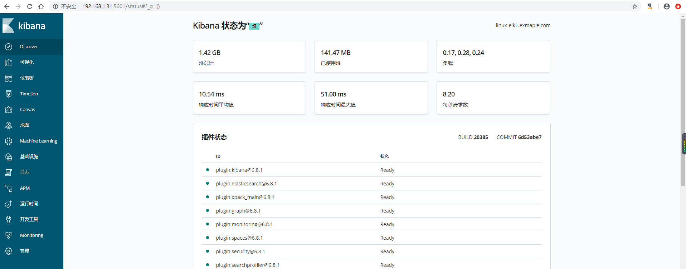
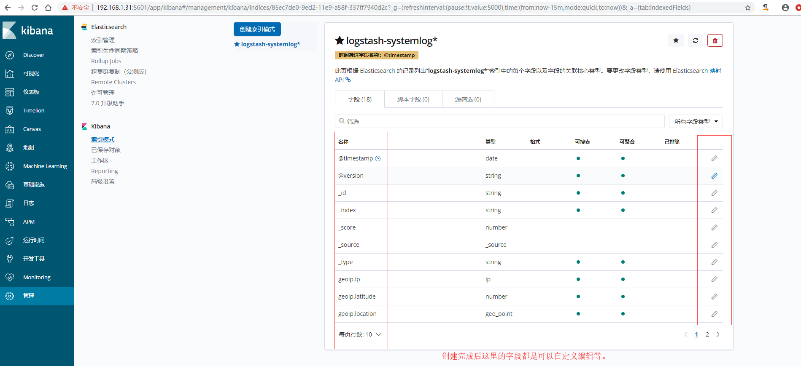

## ELK简介
>什么是ELK？通俗来讲，ELK是由Elasticsearch、Logstash、Kibana 三个开源软件组成的一个组合体，这三个软件当中，每个软件用于完成不同的功能，ELK又称ELKstack，官网 https://www.elastic.co/ ， ELK主要优点有如下几个：
>1、处理方式灵活：elasticsearch是实时全文索引，具有强大的搜索功能
>2、配置相对简单：elasticsearch全部使用JSON接口，logstash使用模块配置，kibana的配置文件部分更简单
>3、检索性能高：基于优秀的设计，虽然每次查询都是实时，但是也可以达到百亿级数据的查询秒级响应
>4、集群线性扩展：elasticsearch和logstash都可以灵活线性扩展
>5、前端操作绚丽：kibana的前端设计比较绚丽，而且操作简单

### Elasticsearch
>`elasticsearch`是一个高度可扩展全文搜索和分析引擎，基于` Apache Lucene` 构建，能对大容量的数据进行接近实时的存储、搜索和分析操作，可以处理大规模日志数据，比如`Nginx`、`Tomcat`、系统日志等功能。

### Logstash
>数据收集引擎。它支持动态的从各种数据源搜集数据，并对数据进行过滤、分析、丰富、统一格式等操作，然后存储到用户指定的位置；支持普通`log`、自定义`json`格式的日志解析。

### Kibana
>数据分析和可视化平台。通常与 `Elasticsearch` 配合使用，对其中数据进行搜索、分析和以统计图表的方式展示。


## ELK部署环境准备
> 这里实验所使用系统`CentOS 7.4 x86_64`，服务器信息如下。并关闭防火墙和`selinux`，及`host`绑定等。本文所使用所有的软件包 [下载](https://pan.baidu.com/s/1ighWPeYVqK6AGZQn55Y_pw)  提取码：`ow1b`

| IPAddr       | HostName               | Mem  
| ------------ | ---------------------- | ---- 
| 192.168.1.31 | linux-elk1.exmaple.com | 3G   
| 192.168.1.32 | linux-elk2.exmaple.com | 3G   

```
epel源配置
# wget -O /etc/yum.repos.d/epel.repo http://mirrors.aliyun.com/repo/epel-7.repo
```

## Elasticsearch部署
>因为`elasticsearch`服务运行需要`java`环境，因此两台`elasticsearch`服务器需要安装`java`环境。


### 安装JDK
>`centos7`默认是安装了`jdk`，如果需要安装高版本可以使用一下步骤，这里使用下面的yum安装`jdk 1.8.0_211` 。注意：两个节点都要安装。

```
方法一：yum安装下载好的JDK包，将下载好的软件包上传到服务器进行安装，首先卸载自带的jdk；再进行安装。
下载地址：https://pan.baidu.com/s/1VK1iCnvouppZ06jsVBOaRw  提取码：lofc

[root@linux-elk1 ~]# rpm -qa |grep jdk |xargs yum -y remove {}\;
[root@linux-elk1 ~]# yum -y localinstall jdk-8u211-linux-x64.rpm
[root@linux-elk1 ~]# java -version
java version "1.8.0_211"
Java(TM) SE Runtime Environment (build 1.8.0_211-b12)
Java HotSpot(TM) 64-Bit Server VM (build 25.211-b12, mixed mode)

方法二：源码安装JDK，将下载的软件包上传到服务器进行安装。
下载地址：https://pan.baidu.com/s/1AAPyPzhdclNNCb0m6ooVYQ  提取码：x18u

[root@linux-elk1 ~]# tar xf jdk-8u211-linux-x64.tar.gz -C /usr/local/
[root@linux-elk1 ~]# ln -s /usr/local/jdk1.8.0_211 /usr/local/java
[root@linux-elk1 ~]# sed -i.ori '$a export JAVA_HOME=/usr/local/java \nexport PATH=$JAVA_HOME/bin:$JAVA_HOME/jre/bin:$PATH \nexport CLASSPATH=.$CLASSPATH:$JAVA_HOME/lib:$JAVA_HOME/jre/lib:$JAVA_HOME/lib/tools.jar' /etc/profile
[root@linux-elk1 ~]# source /etc/profile
[root@linux-elk1 ~]# java -version
java version "1.8.0_211"
Java(TM) SE Runtime Environment (build 1.8.0_211-b12)
Java HotSpot(TM) 64-Bit Server VM (build 25.211-b12, mixed mode)
```


### 安装Elasticsearch
> 两台节点都需要安装elasticsearch，使用yum安装会很慢，所以先下载下来传到服务器进行安装，官网下载地址：https://www.elastic.co/cn/downloads/past-releases#elasticsearch
> 本文所使用的包下载：https://pan.baidu.com/s/1djYOs3PQjtq16VkPMETAWg  提取码：b15v

```
将下载的elasticsearch包上传到服务器进行安装。
[root@linux-elk1 ~]# yum -y localinstall elasticsearch-6.8.1.rpm
[root@linux-elk2 ~]# yum -y localinstall elasticsearch-6.8.1.rpm


配置elasticsearch，linux-elk2配置一个相同的节点，通过组播进行通信，如果无法通过组播查询，修改成单播即可。
[root@linux-elk1 ~]# vim /etc/elasticsearch/elasticsearch.yml
cluster.name: ELK-Cluster    #ELK的集群名称，名称相同即属于是同一个集群
node.name: elk-node1    #本机在集群内的节点名称
path.data: /elk/data    #数据存放目录
path.logs: /elk/logs    #日志保存目录
bootstrap.memory_lock: true    #服务启动的时候锁定足够的内存，防止数据写入swap
network.host: 192.168.1.31    #监听的IP地址
http.port: 9200    #服务监听的端口
discovery.zen.ping.unicast.hosts: ["192.168.1.31", "192.168.1.32"]    #单播配置一台即可


修改内存限制，内存锁定需要进行配置需要2g以上内存，否则会导致无法启动elasticsearch。
[root@linux-elk1 ~]# vim /usr/lib/systemd/system/elasticsearch.service
# 在[Service]下加入下面这行内容
LimitMEMLOCK=infinity
[root@linux-elk1 ~]# systemctl daemon-reload
[root@linux-elk1 ~]# vim /etc/elasticsearch/jvm.options
-Xms2g
-Xmx2g     #最小和最大内存限制，为什么最小和最大设置一样大？参考：https://www.elastic.co/guide/en/elasticsearch/reference/current/heap-size.html


创建数据目录和日志目录及权限修改
[root@linux-elk1 ~]# mkdir -p /elk/{data,logs}
[root@linux-elk1 ~]# chown elasticsearch.elasticsearch /elk/ -R


启动elasticsearch及检查端口是否处于监听状态
[root@linux-elk1 ~]# systemctl start elasticsearch
[root@linux-elk1 ~]# netstat -nltup |grep java
tcp6       0      0 192.168.1.31:9200       :::*                    LISTEN      12887/java          
tcp6       0      0 192.168.1.31:9300       :::*                    LISTEN      12887/java


将配置文件copy到linux-elk2上面并进行修改，配置启动等。
[root@linux-elk1 ~]# scp /etc/elasticsearch/elasticsearch.yml 192.168.1.32:/etc/elasticsearch/elasticsearch.yml
[root@linux-elk2 ~]# grep ^[a-Z] /etc/elasticsearch/elasticsearch.yml 
cluster.name: ELK-Cluster
node.name: elk-node2
path.data: /elk/data
path.logs: /elk/logs
bootstrap.memory_lock: true
network.host: 192.168.1.32
http.port: 9200
discovery.zen.ping.unicast.hosts: ["192.168.1.31", "192.168.1.32"]
[root@linux-elk2 ~]# vim /usr/lib/systemd/system/elasticsearch.service
# 在[Service]下加入下面这行内容
LimitMEMLOCK=infinity
[root@linux-elk2 ~]# systemctl daemon-reload
[root@linux-elk2 ~]# vim /etc/elasticsearch/jvm.options
-Xms2g
-Xmx2g
[root@linux-elk2 ~]# mkdir -p /elk/{data,logs}
[root@linux-elk2 ~]# chown elasticsearch.elasticsearch /elk/ -R
[root@linux-elk2 ~]# systemctl start elasticsearch
[root@linux-elk2 ~]#  netstat -nltup |grep java
tcp6       0      0 192.168.1.32:9200       :::*                    LISTEN      18667/java          
tcp6       0      0 192.168.1.32:9300       :::*                    LISTEN      18667/java 
```
通过浏览器访问`elasticsearch`端口




#### 监控elasticsearch集群状态
>通过shell命令获取集群状态，这里获取到的是一个json格式的返回值，例如对status进行分析，如果等于green(绿色)就是运行在正常，等于yellow(黄色)表示副本分片丢失，red(红色)表示主分片丢失。
```
[root@linux-elk1 ~]# curl http://192.168.1.31:9200/_cluster/health?pretty=true
{
  "cluster_name" : "ELK-Cluster",
  "status" : "green",
  "timed_out" : false,
  "number_of_nodes" : 2,
  "number_of_data_nodes" : 2,
  "active_primary_shards" : 0,
  "active_shards" : 0,
  "relocating_shards" : 0,
  "initializing_shards" : 0,
  "unassigned_shards" : 0,
  "delayed_unassigned_shards" : 0,
  "number_of_pending_tasks" : 0,
  "number_of_in_flight_fetch" : 0,
  "task_max_waiting_in_queue_millis" : 0,
  "active_shards_percent_as_number" : 100.0
}

[root@linux-elk1 ~]# curl http://192.168.1.32:9200/_cluster/health?pretty=true
{
  "cluster_name" : "ELK-Cluster",
  "status" : "green",
  "timed_out" : false,
  "number_of_nodes" : 2,
  "number_of_data_nodes" : 2,
  "active_primary_shards" : 0,
  "active_shards" : 0,
  "relocating_shards" : 0,
  "initializing_shards" : 0,
  "unassigned_shards" : 0,
  "delayed_unassigned_shards" : 0,
  "number_of_pending_tasks" : 0,
  "number_of_in_flight_fetch" : 0,
  "task_max_waiting_in_queue_millis" : 0,
  "active_shards_percent_as_number" : 100.0
}
```


#### 安装elasticsearch插件head
>我们不可能经常通过命令来查看集群的信息，所以就使用到了插件 --`head`。件是为了完成不同的功能，官方提供了一些插件但大部分是收费的，另外也有一些开发爱好者提供的插件，可以实现对`elasticsearch`集群的状态监控与管理配置等功能。
>head：主要用来做集群管理的插件
>下载地址：https://github.com/mobz/elasticsearch-head

1）安装
```
# 安装npm和git
[root@linux-elk1 ~]# yum -y install npm git

# 安装elasticsearch-head插件
[root@linux-elk1 ~]# cd /usr/local/src/
[root@linux-elk1 src]# git clone git://github.com/mobz/elasticsearch-head.git
[root@linux-elk1 src]# cd elasticsearch-head/
[root@linux-elk1 elasticsearch-head]# npm install grunt -save --registry=https://registry.npm.taobao.org
[root@linux-elk1 elasticsearch-head]# ll node_modules/grunt    #确定该目录有生成文件
总用量 24
drwxr-xr-x. 2 root root   19 4月   6 2016 bin
-rw-r--r--. 1 root root 7111 4月   6 2016 CHANGELOG
drwxr-xr-x. 4 root root   47 7月   4 09:21 lib
-rw-r--r--. 1 root root 1592 3月  23 2016 LICENSE
drwxr-xr-x. 5 root root   50 7月   4 09:21 node_modules
-rw-r--r--. 1 root root 4108 7月   4 09:21 package.json
-rw-r--r--. 1 root root  878 2月  12 2016 README.md
[root@linux-elk1 elasticsearch-head]# npm install --registry=https://registry.npm.taobao.org    #执行安装
[root@linux-elk1 elasticsearch-head]# npm run start &    #后台启动服务
[root@linux-elk1 ~]# ss -nlt |grep 9100
LISTEN     0      128          *:9100                     *:* 

#------------------------补充说明------------------------
由于上面npm安装时候超级慢，使用taobao源同样慢，这里将已安装的打成了包，可以直接下载使用即可
下载地址：https://pan.baidu.com/s/16zDlecKVfmkEeInPcRx9NQ   提取码：h890
[root@linux-elk1 ~]# yum -y install npm
[root@linux-elk1 ~]# cd /usr/local/src/
[root@linux-elk1 src]# ls
elasticsearch-head.tar.gz
[root@linux-elk1 src]# tar xvzf elasticsearch-head.tar.gz
[root@linux-elk1 src]# cd elasticsearch-head/
[root@linux-elk1 elasticsearch-head]# npm run start &
#--------------------------------------------------------

# 修改elasticsearch服务配置文件，开启跨域访问支持，然后重启elasticsearch服务
[root@linux-elk1 ~]# vim /etc/elasticsearch/elasticsearch.yml
http.cors.enabled: true     #最下方添加
http.cors.allow-origin: "*"
```

为了方便管理`elasticsearch-head`插件，编写一个启动脚本
```
[root@linux-elk1 ~]# vim /usr/bin/elasticsearch-head
#!/bin/bash
#desc: elasticsearch-head service manager
#date: 2019

data="cd /usr/local/src/elasticsearch-head/; nohup npm run start > /dev/null 2>&1 & "

function START (){
    eval $data && echo -e "elasticsearch-head start\033[32m     ok\033[0m"
}

function STOP (){
    ps -ef |grep grunt |grep -v "grep" |awk '{print $2}' |xargs kill -s 9 > /dev/null && echo -e "elasticsearch-head stop\033[32m      ok\033[0m"
}

case "$1" in
    start)
        START
        ;;
    stop)
        STOP
        ;;
    restart)
        STOP
        sleep 3
        START
        ;;
    *)
        echo "Usage: elasticsearch-head (start|stop|restart)"
        ;;
esac

[root@linux-elk1 ~]# chmod +x /usr/bin/elasticsearch-head
```


2）浏览器访问`9100端口`，将连接地址修改为`elasticsearch`地址。


3）测试提交数据


4）验证索引是否存在


5）查看数据


6）Master和Slave的区别：
>`Master`的职责：
>统计各`node`节点状态信息、集群状态信息统计、索引的创建和删除、索引分配的管理、关闭`node`节点等
>`Savle`的职责：
>同步数据、等待机会称为`Master`


## Logstash部署
>Logstash 是一个开源的数据收集引擎，可以水平伸缩，而且logstash是整个ELK当中拥有最多插件的一个组件，其可以接收来自不同来源的数据并同意输出到指定的且可以是多个不同目的地。官网下载地址：https://www.elastic.co/cn/downloads/past-releases#logstash

### 安装logstash
```
[root@linux-elk1 ~]# wget https://artifacts.elastic.co/downloads/logstash/logstash-6.8.1.rpm
[root@linux-elk1 ~]# yum -y localinstall logstash-6.8.1.rpm
```
### 测试logstash是否正常
1）测试标准输入输出
```
[root@linux-elk1 ~]# /usr/share/logstash/bin/logstash -e 'input { stdin {} } output { stdout { codec => rubydebug} }'  
hello world    #输入

{
      "@version" => "1",    #事件版本号，一个事件就是一个ruby对象
    "@timestamp" => 2019-07-04T04:30:35.106Z,    #当前事件发生的事件
          "host" => "linux-elk1.exmaple.com",    #标记事件发生在哪里
       "message" => "hello world"    #消息的具体内容
}
```
2）测试输出到文件
```
[root@linux-elk1 ~]# /usr/share/logstash/bin/logstash   -e 'input { stdin{} } output { file { path => "/tmp/log-%{+YYYY.MM.dd}messages.gz"}}'
hello world   #输入
[INFO ] 2019-07-04 17:33:06.065 [[main]>worker0] file - Opening file {:path=>"/tmp/log-2019.07.04messages.gz"}

[root@linux-elk1 ~]# tail /tmp/log-2019.07.04messages.gz 
{"message":"hello world","@version":"1","host":"linux-elk1.exmaple.com","@timestamp":"2019-07-04T09:33:05.698Z"}
```
3）测试输出到elasticsearch
```
[root@linux-elk1 ~]# /usr/share/logstash/bin/logstash   -e 'input {  stdin{} } output { elasticsearch {hosts => ["192.168.1.31:9200"] index => "mytest-%{+YYYY.MM.dd}" }}'
```
4）elasticsearch服务器验证收到数据
```
[root@linux-elk1 ~]# ll /elk/data/nodes/0/indices/
总用量 0
drwxr-xr-x. 8 elasticsearch elasticsearch 65 7月   4 17:23 4jaihRq6Qu6NQWVxbuRQZg
drwxr-xr-x. 8 elasticsearch elasticsearch 65 7月   4 17:22 kkd_RCldSeaCX3y1XKzdgA
```


## kibana部署
>`Kibana`是一个通过调用`elasticsearch`服务器进行图形化展示搜索结果的开源项目。官网下载地址：https://www.elastic.co/cn/downloads/past-releases#kibana

### 安装kibana
```
[root@linux-elk1 ~]# wget https://artifacts.elastic.co/downloads/kibana/kibana-6.8.1-x86_64.rpm
[root@linux-elk1 ~]# yum -y localinstall kibana-6.8.1-x86_64.rpm
[root@linux-elk1 ~]# vim /etc/kibana/kibana.yml 
[root@linux-elk1 ~]# grep ^[a-Z] /etc/kibana/kibana.yml 
server.port: 5601    #监听端口
server.host: "192.168.1.31"    #监听地址
elasticsearch.hosts: ["http://192.168.1.31:9200"]    #elasticsearch服务器地址
i18n.locale: "zh-CN"    #修改为中文
```
### 启动kibana并验证
```
[root@linux-elk1 ~]# systemctl start kibana
[root@linux-elk1 ~]# systemctl enable kibana
[root@linux-elk1 ~]# ss -nlt  |grep 5601
LISTEN     0      128    192.168.1.31:5601                     *:*
```
### 查看状态



## 通过logstash收集系统message日志
>说明：通过`logstash`收集别的日志文件，前提需要`logstash`用户对被收集的日志文件有读的权限并对写入的文件有写的权限

1）配置`logstash`配置文件
```
[root@linux-elk1 ~]# vim /etc/logstash/conf.d/system-log.conf
input {
    file {
        path => "/var/log/messages"    #日志路径
        type => "systemlog"            #类型，自定义，在进行多个日志收集存储时可以通过该项进行判断输出
        start_position => "beginning"        #logstash 从什么位置开始读取文件数据，默认是结束位置，也就是说 logstash 进程会以类似 tail -F 的形式运行。如果你是要导入原有数据，把这个设定改成 "beginning"，logstash 进程就从头开始读取，类似 less +F 的形式运行。
		stat_interval => "2"    #logstash 每隔多久检查一次被监听文件状态（是否有更新），默认是 1 秒
    }
}

output {
    elasticsearch {
        hosts => ["192.168.1.31:9200"]        #elasticsearch服务器地址
        index => "logstash-%{type}-%{+YYYY.MM.dd}"    #索引名称
    }
}
```
2）检测配置文件语法是否有错误
```
[root@linux-elk1 ~]# /usr/share/logstash/bin/logstash -f /etc/logstash/conf.d/system-log.conf -t    #检测配置文件是否有语法错误
WARNING: Could not find logstash.yml which is typically located in $LS_HOME/config or /etc/logstash. You can specify the path using --path.settings. Continuing using the defaults
Could not find log4j2 configuration at path /usr/share/logstash/config/log4j2.properties. Using default config which logs errors to the console
[WARN ] 2019-07-05 10:09:59.423 [LogStash::Runner] multilocal - Ignoring the 'pipelines.yml' file because modules or command line options are specified
Configuration OK
[INFO ] 2019-07-05 10:10:27.993 [LogStash::Runner] runner - Using config.test_and_exit mode. Config Validation Result: OK. Exiting Logstash
```
3）修改日志文件的权限并重启`logstash`
```
[root@linux-elk1 ~]# ll /var/log/messages     
-rw-------. 1 root root 786219 7月   5 10:10 /var/log/messages
#这里可以看到该日志文件是600权限，而elasticsearch是运行在elasticsearch用户下，这样elasticsearch是无法收集日志的。所以这里需要更改日志的权限，否则会报权限拒绝的错误。在日志中查看/var/log/logstash/logstash-plain.log 是否有错误。
[root@linux-elk1 ~]# chmod 644 /var/log/messages
[root@linux-elk1 ~]# systemctl  restart logstash
```
4）elasticsearch界面查看并查询


5）kibana界面创建索引并查看





