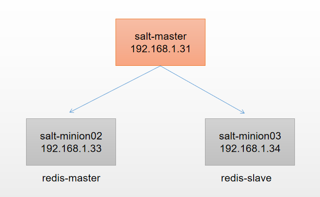

>很多时候我们在编写`state` 文件时候需要进行判断，判断该目录或文件是否存在，判断该配置是否已经已添加，然后根据判断结果再决定命令或动作是否执行，这时候就需要用到了状态判断的`unless`和`onlyif`。

## unless
`unless`示例：需求创建`/tmp/unless.txt`文件，存在则不创建，不存在则创建
```
[root@salt-master ~]# cat /srv/salt/prod/unless.sls 
test-unless:
  cmd.run:
    - name: touch /tmp/unless.txt
    - unless: test -f /tmp/unless.txt


[root@salt-master ~]# salt 'salt-minion01' state.sls unless saltenv=prod
salt-minion01:
----------
          ID: test-unless
    Function: cmd.run
        Name: touch /tmp/unless.txt
      Result: True
     Comment: Command "touch /tmp/unless.txt" run
     Started: 15:10:51.522319
    Duration: 31.822 ms
     Changes:   
              ----------
              pid:
                  6538
              retcode:
                  0
              stderr:
              stdout:

Summary for salt-minion01
------------
Succeeded: 1 (changed=1)
Failed:    0
------------
Total states run:     1
Total run time:  31.822 ms
#上面第一次执行，可以看到发生了一次更改，创建了 /tmp/unless.txt文件


[root@salt-master ~]# salt 'salt-minion01' state.sls unless saltenv=prod
salt-minion01:
----------
          ID: test-unless
    Function: cmd.run
        Name: touch /tmp/unless.txt
      Result: True
     Comment: unless condition is true
     Started: 15:11:40.819789
    Duration: 10.477 ms
     Changes:   

Summary for salt-minion01
------------
Succeeded: 1
Failed:    0
------------
Total states run:     1
Total run time:  10.477 ms
#第二次执行，可以看到该文件已经存在，并没有再次创建
```
>通过上面的小案例可以看出，当`unless`返回为真则不执行，当`unless`返回为假才执行。

## onlyif
> `onlyif`正好和`unless`相反，当`onlyif`返回为真执行，当`onlyif`返回为假不执行

`onlyif`示例：需求，当`/tmp/onlyif.txt`文件存在，则创建`/tmp/onlyif`目录，不存在，则不创建`/tmp/onlyif`目录
```
[root@salt-master ~]# cat /srv/salt/prod/onlyif.sls 
test-onlyif:
  cmd.run:
    - name: mkdir /tmp/onlyif
    - onlyif: test -f /tmp/onlyif.txt


[root@salt-master ~]# salt 'salt-minion01' state.sls onlyif saltenv=prod
salt-minion01:
----------
          ID: test-onlyif
    Function: cmd.run
        Name: mkdir /tmp/onlyif
      Result: True
     Comment: onlyif condition is false
     Started: 15:34:56.460583
    Duration: 9.612 ms
     Changes:   

Summary for salt-minion01
------------
Succeeded: 1
Failed:    0
------------
Total states run:     1
Total run time:   9.612 ms

#通过上面可以看到，由于/tmp/onlyif.txt文件不存在，并没有创建；手动创建一个/tmp/onlyif.txt文件再次执行
[root@salt-master ~]# salt 'salt-minion01' cmd.run "touch /tmp/onlyif.txt"
salt-minion01:
[root@salt-master ~]# salt 'salt-minion01' state.sls onlyif saltenv=prod
salt-minion01:
----------
          ID: test-onlyif
    Function: cmd.run
        Name: mkdir /tmp/onlyif
      Result: True
     Comment: Command "mkdir /tmp/onlyif" run
     Started: 15:38:07.712492
    Duration: 14.646 ms
     Changes:   
              ----------
              pid:
                  6871
              retcode:
                  0
              stderr:
              stdout:

Summary for salt-minion01
------------
Succeeded: 1 (changed=1)
Failed:    0
------------
Total states run:     1
Total run time:  14.646 ms

#可以看到上面我们手动创建了一个/tmp/onlyif.txt文件后再次执行，则发生了改变，在/tmp/创建了onlyif目录
```
## Redis主从架构案例
说明：该案例在`prod`环境配置


1）环境准备，定义`file_roots`环境
```
[root@salt-master ~]# vim /etc/salt/master
file_roots:
  base:
    - /srv/salt/base
  dev:
    - /srv/salt/dev
  prod:
    - /srv/salt/prod
```
2）创建对应环境目录
```
[root@salt-master ~]# mkdir -p /srv/salt/{base,dev,prod}
[root@salt-master ~]# mkdir -p /srv/salt/prod/redis/files/
```
3）编写`state sls`状态文件
```
#初始化redis（安装和基本配置）
[root@salt-master ~]# cat /srv/salt/prod/redis/init.sls 
redis-install:
  pkg.installed:
    - name: redis

redis-config:
  file.managed:
    - name: /etc/redis.conf
    - source: salt://redis/files/redis.conf
    - user: root
    - group: root
    - mode: 644
    - template: jinja
    - defaults:
      BIND: {{ grains['fqdn_ip4'][0] }}
      PORT: 6379
      DAEMONIZA: 'yes'
    - require:
      - pkg: redis-install

redis-service:
  service.running:
    - name: redis
    - enable: True
    - watch:
      - file: redis-config


#master直接引入 init
[root@salt-master ~]# cat /srv/salt/prod/redis/master.sls 
include:
  - redis.init


#slave引入init 并配置主从信息
[root@salt-master ~]# cat /srv/salt/prod/redis/slave.sls 
include:
  - redis.init

#配置主从
slave-config:
  cmd.run:
    - name: redis-cli -h 192.168.1.34 slaveof 192.168.1.33 6379
    - unless: redis-cli -h 192.168.1.34 info |grep role:slave
    - require:
      - service: redis-service

说明：
unless：返回为真则不执行，反之为假则执行
```
4）配置文件准备
```
[root@salt-master ~]# grep "^[a-Z]" /etc/redis.conf  >>/srv/salt/prod/redis/files/redis.conf
[root@salt-master ~]# cat /srv/salt/prod/redis/files/redis.conf 
#这里使用jinja
bind {{ BIND }}
protected-mode yes
#这里使用jinja
port {{ PORT }}
tcp-backlog 511
timeout 0
tcp-keepalive 300
#这里使用jinja
daemonize {{ DAEMONIZA }}
supervised no
pidfile /var/run/redis_6379.pid
loglevel notice
logfile /var/log/redis/redis.log
databases 16
save 900 1
save 300 10
save 60 10000
stop-writes-on-bgsave-error yes
rdbcompression yes
rdbchecksum yes
dbfilename dump.rdb
dir /var/lib/redis
slave-serve-stale-data yes
slave-read-only yes
repl-diskless-sync no
repl-diskless-sync-delay 5
repl-disable-tcp-nodelay no
slave-priority 100
appendonly no
appendfilename "appendonly.aof"
appendfsync everysec
no-appendfsync-on-rewrite no
auto-aof-rewrite-percentage 100
auto-aof-rewrite-min-size 64mb
aof-load-truncated yes
lua-time-limit 5000
slowlog-log-slower-than 10000
slowlog-max-len 128
latency-monitor-threshold 0
notify-keyspace-events ""
hash-max-ziplist-entries 512
hash-max-ziplist-value 64
list-max-ziplist-size -2
list-compress-depth 0
set-max-intset-entries 512
zset-max-ziplist-entries 128
zset-max-ziplist-value 64
hll-sparse-max-bytes 3000
activerehashing yes
client-output-buffer-limit normal 0 0 0
client-output-buffer-limit slave 256mb 64mb 60
client-output-buffer-limit pubsub 32mb 8mb 60
hz 10
aof-rewrite-incremental-fsync yes
```
5）`top file`文件编写
```
[root@salt-master ~]# cat /srv/salt/base/top.sls 
prod:
  'salt-minion02':
    - redis.master
  'salt-minion03':
    - redis.slave
```
6）整体`state`文件查看
```
[root@salt-master ~]# tree /srv/salt/prod/redis/
/srv/salt/prod/redis/
├── files
│   └── redis.conf
├── init.sls
├── master.sls
└── slave.sls

1 directory, 4 files
```
7）`top file`高级状态执行
```
#先测试下看下状态文件是否编写正确，再正式执行
[root@salt-master ~]# salt '*' state.highstate test=True
[root@salt-master ~]# salt '*' state.highstate
```
