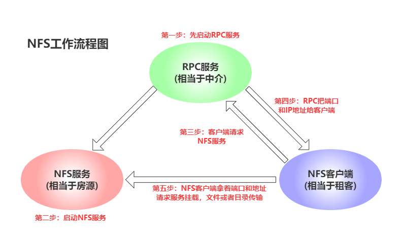

## NFS介绍
[官方文档](http://nfs.sourceforge.net/nfs-howto/)

> `NFS（Network File System）`即网络文件系统，它最大的功能就是通过`TCP/IP`网络共享资源。在`NFS`的应用中，本地`NFS`的客户端应用可以透明地读写位于远端`NFS`服务器上的文件，就像访问本地文件一样。

>`NFS`客户端一般是应用服务器（比如`web`，负载均衡等），可以通过挂载的方式将`NFS`服务器端共享的目录挂载到`NFS`客户端本地的目录下。

> 因为`NFS`支持的功能相当的多，而不同的功能都会使用不同的程序来启动，每启动一个功能就会启用一些端口来传输数据，因此，`NFS`的功能所对应的端口才没有固定住，而是随机取用一些未被使用的小于`1024`的端口来作为传输之用。但如此一来又造成了客户端想要连上服务器时的困扰，因为客户端得要知道服务器端的相关端口才能够进行连接。

>因此就需要远程过程调用`(RPC)`的服务，`RPC`最主要的功能就是在指定每个`NFS`功能所对应的` port number`，并且回报给客户端，让客户端可以连接正确的端口上去。那`RPC`又是如何知道每个`NFS`的端口呢？这是因为当服务器在启动`NFS`时会随机取用数个端口，并主动的想`RPC`注册，因此`RPC`可以知道每个端口对应的`NFS`功能，然后`RPC`又是固定使用` port 111`来监听客户端的需求并回报给客户端正确的端口，所以当然可以让`NFS`的启动更为轻松愉快了。

>`NFS`在文件传送过程中依赖与`RPC`（远程过程调用）协议。`NFS`本身是没有提供信息传送的协议和功能的，但是能够用过网络进行图片，视频，附件等分享功能。只要用到NFS的地方都需要启动`RPC`服务，不论是`NFS`的服务端还是客户端。

>`NFS`和`RPC`的关系：可以理解为`NFS`是一个网络文件系统（比喻为租房的房主），而`RPC`是负责信息的传输（中介），客户端（相当于租房的租客）。

### NFS网络文件系统存在的意义
实现数据共享，数据保持一致。如图所示：


### NFS网络文件系统工作方式
>1、在`nfs`服务器端创建共享目录
>2、通过`mount`网络挂载，将`NFS`服务端共享目录挂载到`NFS`客户端本地目录
>3、`NFS`客户端在挂载目录上创建、删除、查看数据等操作，等价于在服务端进行的创建、删除、查看数据等操作。


如上图所示，在`NFS`服务器端设置一个共享目录`/web`后，其他有权限访问`NFS`服务器端的客户端都可以将这个共享目录`/web`挂载到客户端本地的某个挂载点（其实就是一个目录，这个挂载点可以自己随意指定），不同的客户端的挂载点可以不相同。
客户端正确挂载完毕后，就可以通过`NFS`客户端的挂载点所在的`/opt/www`目录查看到`NFS`服务端`/web`共享出来的目录下的所有数据。在客户端查看时，`NFS`服务端的`/web`目录就相当于客户端本地的磁盘分区或目录，几乎感觉不到使用上的区别，根据`NFS`服务器端授予的`NFS`共享权限以及共享目录的本地系统权限，只要在指定的`NFS`客户端操作挂载的`/opt/www`目录，就可以将数据轻松的存取到`NFS`服务器端上的`/web`目录中了。


### NFS工作流程


### RPC服务工作原理


## NFS部署示例
### 环境规划
| 操作系统           | 角色                      | IP           | HOST            |
| ------------------ | ------------------------- | ------------ | --------------- |
| CentOS release 7.4 | NFS Server                | 192.168.1.31 | nfs-server.com  |
| CentOS release 7.4 | NFS Client1 (web server1) | 192.168.1.32 | nfs-client1.com |
| CentOS release 7.4 | NFS Client2 (web server2) | 192.168.1.33 | nfs-client2.com |

> 这里`NFS`客户端是`web`服务器，站点目录挂载`NFS`服务端。
> 实验环境关闭防火墙、selinux、时间同步等

### 具体操作步骤
**服务端安装配置**
1）检查是否安装`NFS、RPC`服务
```
[root@nfs-server ~]# rpm -aq |egrep "nfs-utils|rpcbind"
rpcbind-0.2.0-42.el7.x86_64
nfs-utils-1.3.0-0.48.el7.x86_64

# 如果没有安装则进行安装
# yum -y install nfs-utils rpcbind
```
2）启动`rpc`和`nfs`服务
```
[root@nfs-server ~]# systemctl start rpcbind
[root@nfs-server ~]# systemctl enable rpcbind
[root@nfs-server ~]# systemctl start nfs
```
3）可以通过`rpcinfo -p localhost`可以查看到绑定了`nfs`
```
[root@nfs-server ~]# rpcinfo -p localhost
   program vers proto   port  service
    100000    4   tcp    111  portmapper
    100000    3   tcp    111  portmapper
    100000    2   tcp    111  portmapper
    100000    4   udp    111  portmapper
    100000    3   udp    111  portmapper
    100000    2   udp    111  portmapper
    100005    1   udp  20048  mountd
    100005    1   tcp  20048  mountd
    100005    2   udp  20048  mountd
    100005    2   tcp  20048  mountd
    100005    3   udp  20048  mountd
    100005    3   tcp  20048  mountd
    100024    1   udp  60358  status
    100024    1   tcp  34912  status
    100003    3   tcp   2049  nfs
    100003    4   tcp   2049  nfs
    100227    3   tcp   2049  nfs_acl
    100003    3   udp   2049  nfs
    100003    4   udp   2049  nfs
    100227    3   udp   2049  nfs_acl
    100021    1   udp  38577  nlockmgr
    100021    3   udp  38577  nlockmgr
    100021    4   udp  38577  nlockmgr
    100021    1   tcp  42193  nlockmgr
    100021    3   tcp  42193  nlockmgr
    100021    4   tcp  42193  nlockmgr
```
4）配置共享目录并重启`nfs`
```
[root@nfs-server ~]# mkdir /web
[root@nfs-server ~]# vim /etc/exports
/web    192.168.1.0/24(rw,sync,no_root_squash)  #不压制root(当client端使用root挂载时，也有root权限)
[root@nfs-server ~]# systemctl restart nfs
[root@nfs-server ~]# exportfs -v
/web          	192.168.1.0/24(sync,wdelay,hide,no_subtree_check,sec=sys,rw,secure,no_root_squash,no_all_squash)
```

**客户端挂载测试**
1）创建挂载目录并进行挂载
```
[root@nfs-client1 ~]# mkdir /opt/www
[root@nfs-client1 ~]# showmount -e 192.168.1.31    #查看服务器共享目录
Export list for 192.168.1.31:
/web 192.168.1.0/24
[root@nfs-client1 ~]# mount -t nfs 192.168.1.31:/web /opt/www/
[root@nfs-client1 ~]# df -h
文件系统                 容量  已用  可用 已用% 挂载点
/dev/mapper/centos-root   20G  3.6G   16G   19% /
devtmpfs                 473M     0  473M    0% /dev
tmpfs                    489M     0  489M    0% /dev/shm
tmpfs                    489M   14M  475M    3% /run
tmpfs                    489M     0  489M    0% /sys/fs/cgroup
/dev/sda1                497M  154M  344M   31% /boot
tmpfs                     98M     0   98M    0% /run/user/0
192.168.1.31:/web         20G  3.6G   16G   19% /opt/www
```
2）在`client1`上的`/opt/www`创建一个测试文件
```
[root@nfs-client1 ~]# echo "client1 create test file" >> /opt/www/client1.txt
```
3）回到`nfs`上进行查看
```
[root@nfs-server ~]# ll /web/
总用量 4
-rw-r--r-- 1 root root 25 8月   9 14:41 client1.txt
```
4）安装`nginx`并配置站点目录为`/opt/www`
```
[root@nfs-client1 ~]# yum -y install nginx
[root@nfs-client1 ~]# vim /etc/nginx/nginx.conf
server {
        listen       80 default_server;
        listen       [::]:80 default_server;
        server_name  _;
        root         /opt/www;
...
[root@nfs-client1 ~]# systemctl start nginx
```
上面的步骤同样在`client2`上面操作。

**在nfs服务端创建站点首页，访问client客户端测试**
```
[root@nfs-server ~]# ll /web/
总用量 8
-rw-r--r-- 1 root root 25 8月   9 14:41 client1.txt
-rw-r--r-- 1 root root 25 8月   9 15:37 client2.txt

[root@nfs-server ~]# echo "<h1>NFS server</h1>" >> /web/index.html    #nfs服务端共享目录创建首页文件
[root@nfs-server ~]# curl 192.168.1.32
<h1>NFS server</h1>
[root@nfs-server ~]# 
[root@nfs-server ~]# curl 192.168.1.33
<h1>NFS server</h1>

[root@nfs-client1 ~]# ll /opt/www/    #nfs客户端1上查看
总用量 12
-rw-r--r-- 1 root root 25 8月   9 14:41 client1.txt
-rw-r--r-- 1 root root 25 8月   9 15:37 client2.txt
-rw-r--r-- 1 root root 20 8月   9 15:41 index.html

[root@nfs-client2 ~]# ll /opt/www/    #nfs客户端2上查看
总用量 12
-rw-r--r-- 1 root root 25 8月   9 14:41 client1.txt
-rw-r--r-- 1 root root 25 8月   9 15:37 client2.txt
-rw-r--r-- 1 root root 20 8月   9 15:41 index.html
```
通过测试可以看出，客户端挂载后，就完全相当于自己的一个目录或者文件，在负载均衡架构中一般通过这种方式做共享存储。


### NFS配置参数说明
#### nfs共享参数及作用
通过 `man exports`可以查看帮助手册
| 共享参数       | 作用                                                         |
| -------------- | ------------------------------------------------------------ |
| rw\*            | 读写权限                                                     |
| ro             | 只读权限                                                     |
| root_squash    | 当NFS客户端以root管理员访问时，映射为NFS服务器的匿名用户(不常用) |
| no_root_squash | 当NFS客户端以root管理员访问时，映射为NFS服务器的root管理员(常用) |
| all_squash     | 无论NFS客户端使用什么账户访问，均映射为NFS服务器的匿名用户(常用) |
| no_all_squash  | 无论NFS客户端使用什么账户访问，都不进行压缩                  |
| sync\*          | 同时将数据写入到内存与硬盘中，保证不丢失数据                 |
| async          | 优先将数据保存到内存，然后再写入硬盘；这样效率更高，但可能会丢失数据 |
| anonuid\*       | 配置all_squash使用,指定NFS的用户UID,必须存在系统             |
| anongid\*       | 配置all_squash使用,指定NFS的用户GID,必须存在系统             |


#### 配置实例说明
```
[root@nfs-server ~]# cat /etc/exports
#/web    192.168.1.0/24(rw,sync,no_root_squash)  #不压制root(当client端使用root挂载时，也有root权限)
/web    192.168.1.32(rw,sync,no_root_squash) 192.168.1.33(rw,sync,all_squash,anonuid=2000,anongid=2000)
```
>\#[共享目录]&emsp;  [客户端地址1(权限)]&emsp;  [客户端地址2(权限)] 
>1、共享目录：每一行最前面是共享出来的目录，比如上面我要共享`/web`目录，那么此选项就可以直接写`/web`目录，这个目录可以依照不同的权限共享给不同的目录。
>2、客户端地址：客户端地址能够设置一个网络，也可以是单个主机。参数：如上面的读写权限`rw`，同步更新`sync`等待。
>>1、客户端地址可以使用完整的IP或者网络号，例如`192.168.1.33 `或`192.168.1.0/24`
>>2、同样可以使用主机名，但是这个主机名必须要在`/etc/hosts`中存在，或者可以通过`DNS`找到才行。


